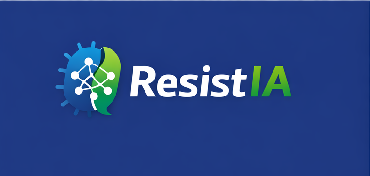
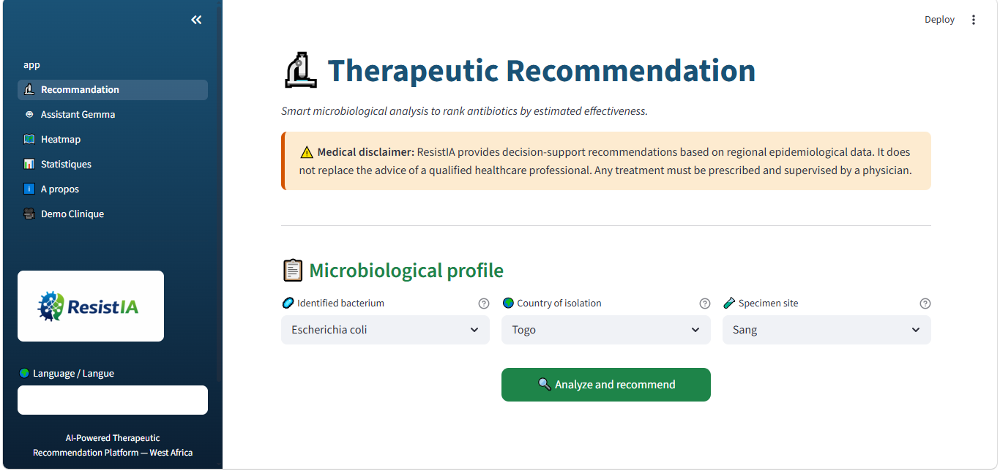
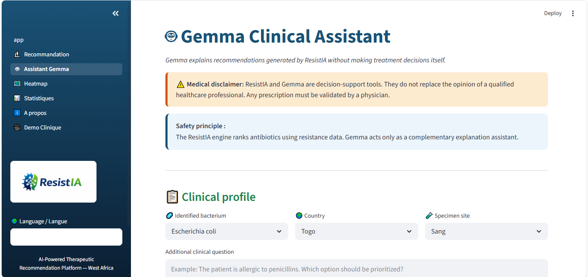
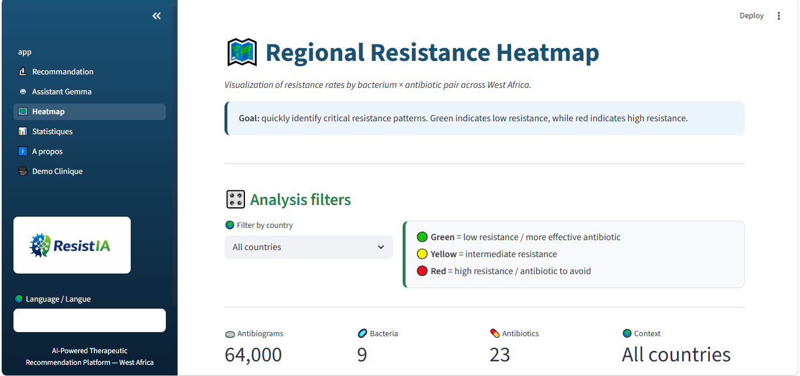
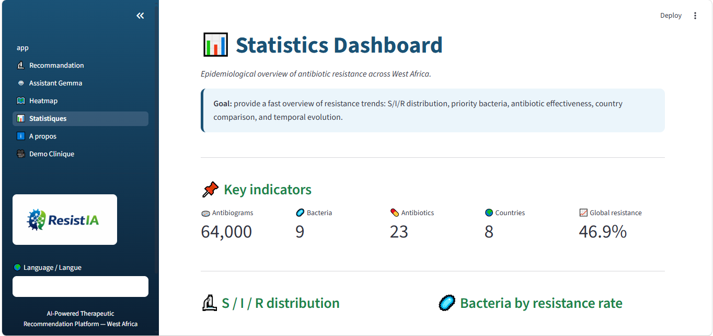

# ResistIA — AI Clinical Decision Support for Antibiotic Resistance



## 🧬 Overview

ResistIA is an AI-powered clinical decision-support platform designed to help healthcare professionals interpret antimicrobial resistance (AMR) profiles and identify relevant antibiotic options in resource-limited settings.

The project focuses on West Africa and combines:

* microbiological resistance analysis,
* epidemiological insights,
* machine learning,
* and local LLM-assisted explanations using Gemma via Ollama.

Rather than replacing clinicians, ResistIA acts as a cautious AI copilot that transforms resistance data into readable and structured therapeutic insights.

---

## 🎯 Why ResistIA?

Antimicrobial resistance is becoming one of the most critical global health challenges.

In many regions, especially in low-resource environments:

* access to infectious disease specialists is limited,
* AMR surveillance data is fragmented,
* and therapeutic decisions are often made under uncertainty.

ResistIA was created to explore how AI can support safer and more explainable antibiotic decision-making.

---

# 🚀 Main Features

## 🔬 Therapeutic Recommendation Engine

Ranks antibiotics according to estimated effectiveness based on historical resistance profiles.

## 🤖 Gemma Clinical Assistant

Uses Gemma locally via Ollama to generate controlled and readable clinical explanations.

## 🗺️ Regional Resistance Heatmap

Visualizes bacterium × antibiotic resistance patterns across ECOWAS countries.

## 📊 Epidemiological Dashboard

Provides statistics and insights about:

* resistance distribution,
* bacterial trends,
* antibiotic effectiveness,
* country comparisons,
* and temporal evolution.

## 🌍 Multilingual Interface

Fully available in:

* English
* Français

---

# 🧠 AI Architecture

## 1. ResistIA Core Engine

The recommendation engine analyzes:

* bacterium,
* country,
* specimen site,
* resistance profiles,
* historical resistance rates.

Antibiotics are classified into:

* Recommended
* Possible
* Use with caution
* Avoid

---

## 2. Machine Learning Layer

ResistIA uses a Scikit-learn probabilistic model trained on calibrated AMR data.

The project includes:

* feature engineering,
* resistance pair analysis,
* epidemiological scoring,
* probabilistic ranking.

---

## 3. Gemma via Ollama

Gemma is integrated locally through Ollama.

Important principle:

> ResistIA decides.
> Gemma explains.

Gemma never replaces the medical recommendation engine.
It only produces complementary explanations to improve readability and user interaction.

---

# 📂 Dataset

The project combines:

* CARD v4.0.1
* WHO GLASS references
* RESAOLAB-inspired regional calibration
* Synthetic ECOWAS AMR profiles

### Current coverage

* 64,000 antibiograms
* 9 major bacteria
* 23 antibiotics
* 8 ECOWAS countries
* 2019–2024 simulated epidemiological context

---

# ⚙️ Tech Stack

* Python
* Streamlit
* Scikit-learn
* Pandas
* Plotly
* Ollama
* Gemma
* GitHub

---

# 🖥️ Local Installation

## 1. Clone the repository

```bash
git clone https://github.com/Ephrem09-TEKO/resistia.git
cd resistia
```

---

## 2. Create environment

```bash
conda create -n resistia python=3.11
conda activate resistia
```

---

## 3. Install dependencies

```bash
pip install -r requirements.txt
```

---

# 🤖 Install Ollama & Gemma

## Install Ollama

Download Ollama:

[Ollama Official Website](https://ollama.com?utm_source=chatgpt.com)

---

## Pull Gemma

```bash
ollama pull gemma:2b
```

---

## Run Gemma

```bash
ollama run gemma:2b
```

Keep this terminal open while using ResistIA.

---

# ▶️ Launch ResistIA

Open another terminal:

```bash
conda activate resistia
cd app
streamlit run App.py
```

Then open:

```text
http://localhost:8501
```

---

# 🏆 Hackathon Positioning

ResistIA was adapted for the Gemma Hackathon with a focus on:

* Health & Sciences
* Safety & Trust
* Ollama Local AI
* Real-world impact

The project demonstrates how local LLMs can assist healthcare workflows responsibly while keeping the decision logic controlled and explainable.

---

# ⚠️ Medical Disclaimer

ResistIA is a clinical decision-support prototype.

It does NOT:

* replace physicians,
* prescribe treatments,
* or constitute medical practice.

All antibiotic decisions must be validated by qualified healthcare professionals.

---

# 👨‍💻 Author

## TEKO Koffi Ephrem Diano

Biomedical Analyst — Data Analytics

📧 [ephremteko@gmail.com](mailto:ephremteko@gmail.com)

📍 Lomé, Togo

---

# 📸 Platform Preview

## 🔬 Therapeutic Recommendation Module
Clinical recommendation engine ranking antibiotics by estimated effectiveness.



---

## 🤖 Gemma Clinical Assistant
Local Gemma-powered explanation assistant integrated through Ollama.



---

## 🗺️ Regional Resistance Heatmap
Interactive resistance visualization across ECOWAS countries.



---

## 📊 Epidemiological Dashboard
Statistical insights and resistance monitoring interface.



---

# 🌍 Vision

ResistIA is not only a prototype.

The long-term goal is to explore how AI-assisted microbiology tools can:

* improve AMR interpretation,
* support healthcare workers,
* and strengthen antibiotic stewardship in underserved regions.
